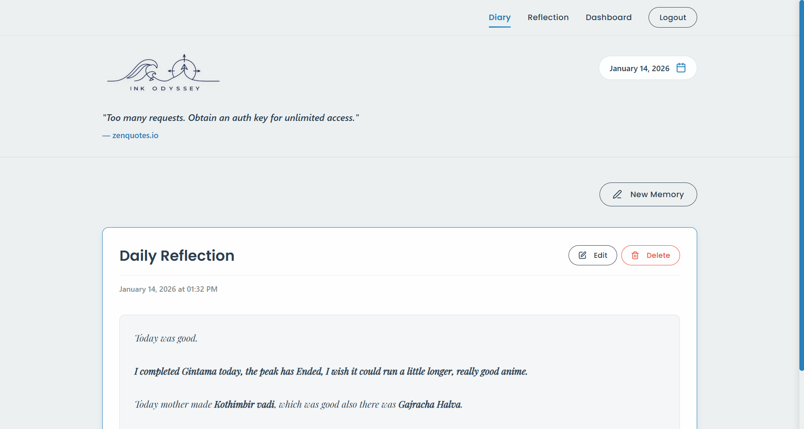
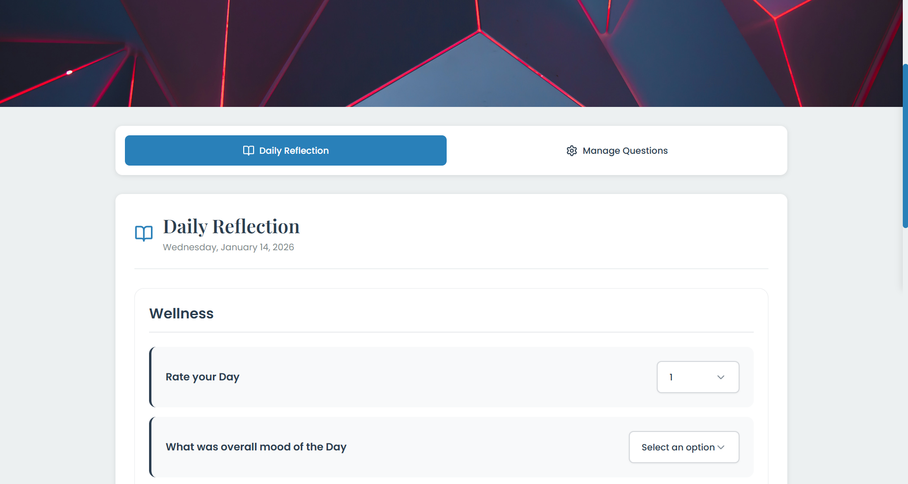

# InkOdyssey

[](https://inkodyssey.vercel.app/)

**Live Demo:** [https://inkodyssey.vercel.app/](https://inkodyssey.vercel.app/)

---

InkOdyssey is a modern, full-stack journaling and self-reflection platform designed to help users track their daily thoughts, moods, habits, and personal growth. With a beautiful, responsive UI and insightful analytics, InkOdyssey empowers you to reflect, grow, and visualize your journey.

## Features

- ✍️ **Diary & Journaling:** Write daily entries, add media, and revisit your memories.
- 📊 **Self-Reflection Dashboard:** Visualize your moods, habits, and custom questions with interactive charts.
- 🧠 **Custom Questions:** Create your own reflection prompts (range, choice, text, number).
- 📅 **Calendar & Streaks:** Track your consistency and see your progress over time.
- 🔒 **Authentication:** Secure user accounts and data privacy.
- 🌙 **Responsive Design:** Optimized for both desktop and mobile devices.

## Screenshots

### Dashboard


### Diary


### Self-Reflection


## Tech Stack

- **Frontend:** React, Vite, Recharts, CSS Modules
- **Backend:** Django, Django REST Framework
- **Database:** SQLite (dev), PostgreSQL (prod-ready)
- **Deployment:** Vercel (Frontend), Render/Heroku (Backend)

## Getting Started

1. **Clone the repository:**
   ```bash
   git clone https://github.com/Aabi0207/InkOdyssey.git
   cd InkOdyssey
   ```
2. **Backend Setup:**
   - Create a virtual environment and install dependencies:
     ```bash
     cd backend
     python -m venv env
     source env/Scripts/activate  # On Windows
     pip install -r requirements.txt
     ```
   - Run migrations and start the server:
     ```bash
     python manage.py migrate
     python manage.py runserver
     ```
3. **Frontend Setup:**
   - Install dependencies and start the dev server:
     ```bash
     cd ../frontend
     npm install
     npm run dev
     ```
4. **Access the app:**
   - Frontend: [http://localhost:5173/](http://localhost:5173/)
   - Backend API: [http://localhost:8000/api/](http://localhost:8000/api/)

## Contributing

Contributions are welcome! Please open issues or pull requests for improvements, bug fixes, or new features.

## License

This project is licensed under the MIT License.

---

Made with ❤️ by [Aabi0207](https://github.com/Aabi0207) and contributors.
